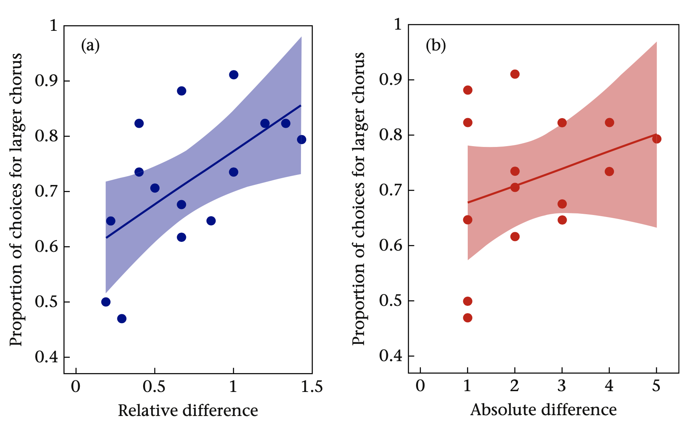
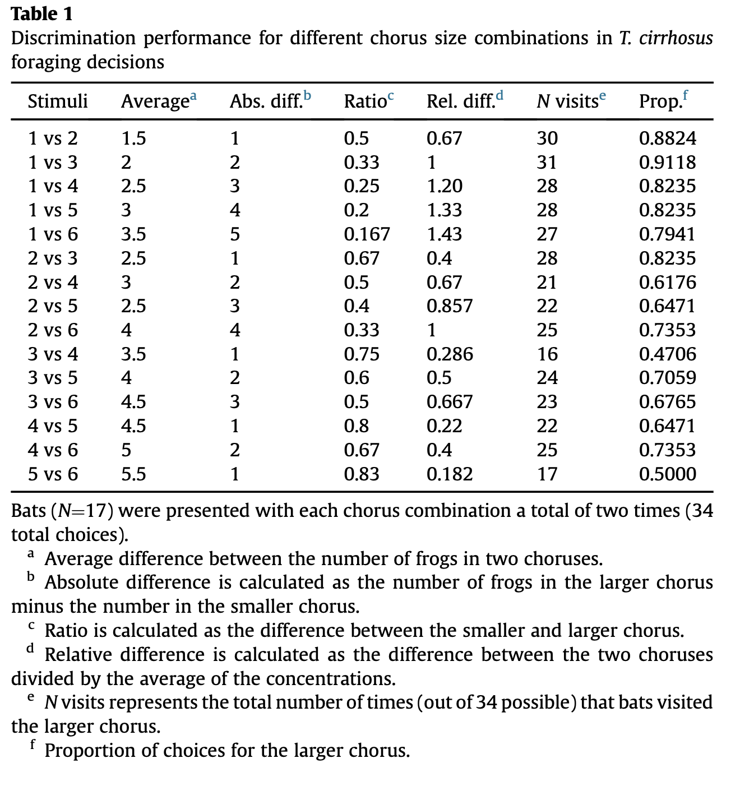
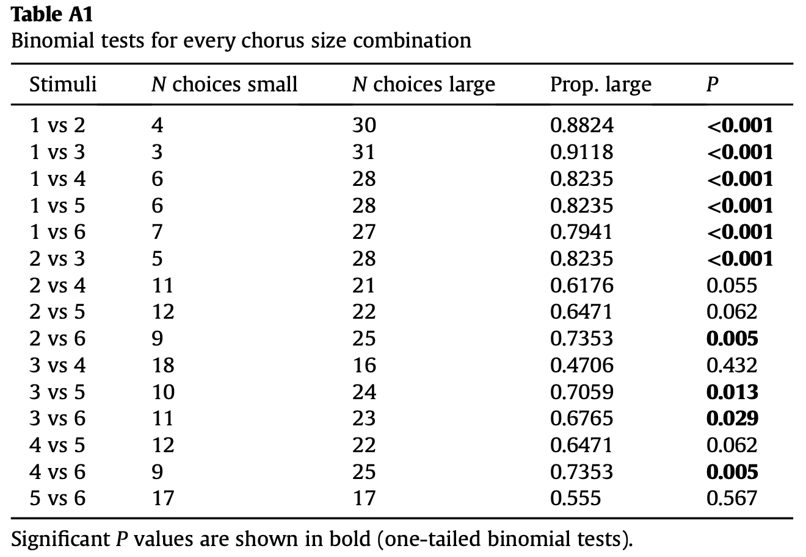
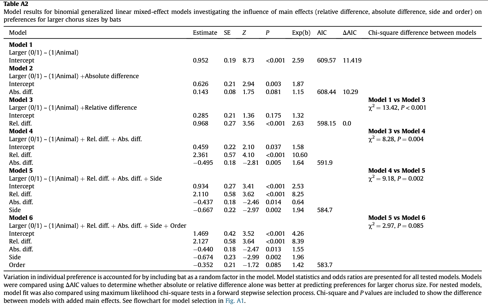

```{r setup, include=FALSE}
knitr::opts_chunk$set(
	echo = TRUE,
	warning = TRUE,
	message = TRUE,
	comment = "##",
	prompt = FALSE,
	tidy = TRUE,
	tidy.opts = list(blank = FALSE, width.cutoff = 75),
	fig.path = "img/",
	fig.align = "center"
)
```

## Introduction

There is imperfection in an animal's ability to perceive physical reality and their cognitive processes and this inconsistency can lead to incorrect assessments in prey choice. Specifically, proportional processing, the ability to assess differences between quantities, can be constrained. This was tested in *Trachops cirrhosus*, given various quantities of frog choruses. Bats genreally preferred larger chorus sizes, but failed to discern the differences in frog chorus sizes in trails between larger choruses (i.e. choruses of 5 and 6 frogs) vs. smaller ones (i.e. 1 and 2 frogs). Thus, this experiment determined that *T. cirrhosus* rely on the relative differences and not the absolute differences in choruses and may be less persnickety when foraging in larger chorusing groups of frogs.

## Visualization of Data

####Replicating Figure 2.

```{r, message = FALSE, warning = FALSE}
#load packages necessary to complete analysis
library(lme4)
library(readr)
library(dplyr)
library(ggplot2)
library(ggthemes)
library(gridExtra)
library(AICcmodavg)
```

```{r}
#read in data
d <- "Hemingway et al._2018_data.csv"
data <- read_csv(d, col_names = TRUE)

#Taking a look at the data-set
names(data)
head(data, 10)

#Calculate absolute and relative differences (absolute diff/mean(number of calls of the twos stimuli)) between chrous size
data %>%
  group_by(Treatment) %>%
  summarise(abs = mean(AbsDiff), rel = mean(RelDiff), prop = sum(Larger)/n()) -> plt
plt
```

Graph from the article:

{width=600px}

```{r}
#Linear regression graphs
theme_set(theme_tufte()) #setting theme for plotting graphs

#joke's on me, I couldn't figure out how to get the confidence intervals to show correctly in base r, so I switched to ggplot(). Bri: 0, ggplot(): 1.

#Graphing Abs Diff
p1 <- ggplot(plt, aes(x = abs, y = prop)) + 
  geom_point(color = 'brown3', size = 3) + 
  geom_smooth(method = lm, fill = 'brown3') +
  geom_smooth(method = lm, color = 'brown3', se = FALSE) +
  ylab(label = "Proportion of choices for larger chorus") +
  xlab(label = "Absolute difference") +
  theme(axis.line = element_line(colour = "black")) + 
  scale_x_discrete(label = c("1","2","3","4","5","6"),limits = c("1","2","3","4","5","6")) +
  scale_y_continuous(limits = c(0.4, 1), breaks = c(0.4,0.5,0.6,0.7,0.8,0.9, 1.0),
                     label = c("0.4","0.5","0.6","0.7","0.8","0.9", "1.0"))

#Graphing Rel Diff
p2 <- ggplot(plt, aes(x = rel, y = prop)) + 
  geom_point(color = 'navy', size = 3) + 
  geom_smooth(method = lm, fill = 'navy') +
  geom_smooth(method = lm, color = 'navy', se = FALSE) +
  ylab(label = "Proportion of choices for larger chorus") +
  xlab(label = "Relative difference") +
  theme(axis.line = element_line(colour = "black")) +
  scale_x_continuous(label = c("0","0.5","1","1.5"), limits = c(0,1.5), breaks = c(0,0.5,1,1.5)) +
  scale_y_continuous(limits = c(0.4, 1), breaks = c(0.4,0.5,0.6,0.7,0.8,0.9, 1.0),
                     label = c("0.4","0.5","0.6","0.7","0.8","0.9", "1.0"))
grid.arrange(p2, p1, ncol = 2, nrow = 1)

#taking a look at the estimates for both
lm1 <- lm(prop ~ abs, data = plt)
summary(lm1)
lm2 <- lm(prop ~ rel, data = plt)
summary(lm2)
#This was not presented within the paper, but provided here to display quantitative differences between the two graphs.
```

## Replications/Reanalysis

Replicated:

  * The proportion of choices observed in bats throughout treatment levels
  * Binomial tests (probability of success & p-values)
  * Linear regression graph (shown above)
  * Replicating binomial generalized linear mixed-effect models

####Replicating calculcation of proportion of choices observed in each treatment level

```{r}
#Obtaining proportion of choices observed
data %>%
  group_by(Treatment) %>%
  summarise(proportion = sum(Larger)/n()) -> proportion_results
#relative differences calculation = (absolute diff/mean(number of calls of the two stimuli))
proportion_results

#some proportions calculated above are slightly different than those reported in the data set:

Hemingway <- c(0.8824, 0.9118, 0.8235, 0.8235, 0.7941, 0.8235, 0.6176, 0.6471, 0.7353, 0.4706, 0.7059, 0.6765, 0.6471, 0.7353, 0.5000) #obtained proportions from Table 1 (below)
```

Proportions from article: 

{width=500px}

```{r}
cbind(proportion_results, Hemingway) #looking at my calculations vs. their's

#Here it's clearer that Treatment levels 2v6 & 5v6 are slightly different proportions

#Handchecking 2v6
table(data$Treatment) #returns a tibble with 35 rows

data %>%
  filter(Treatment == "2v6") %>%
  count(Larger == "1") #total counts of when the bats chose the larger chorus = 25

25/35 #proportion value I get
25/34 #proportion value Hemingway et al gets
```

This suggests **a)** there is a duplication in the data set provided online, **b)** one individual was tested 3 times, instead of 2 times, or **c)** calculation error in article

```{r}
#Checking for duplications

table(data$Animal) #total trials for each individual

data %>%
  group_by(Treatment) %>%
  summarise(Larger = sum(Larger))
```

There are 15 different treatments so there should be 30 total tests for each individual (if they were tested twice). However, indiviudal A was tested at least 3 times (total trials for this individual is 31 instead of 30). Or, there was a duplication in the data set for one trial.
 
Also, another way to see this is by looking at the sum of Larger == 1, which is 18 in this data set (represented as *N* visits). However, the paper reports 17 for 2v6 (see table above).

```{r}
#Handchecking 5v6
data %>%
  filter(Treatment == "5v6") %>%
  count(Larger == "1") #total counts of when the bats chose the larger chorus = 18

18/34 #proportion value I get
18/36 #proportion value Hemingway et al gets
```

Given that the total number trials for each individual was reported to only be 34 and the calculation for the prorportion value Hemingway et al gets is 36, it could be that **a)** trial(s) is/are missing for indivual(s) in the dataset that was provided online, indicating that an individual underwent two extra trials or two individuals went through 1 extra trial or **b)** calculation error.

####Replication of binomial tests

```{r}
#replicate just one binomial test, to see if this format works
temp <- filter(data, Treatment== "1v2")
binom.test(x = sum(temp$Larger), n = nrow(temp), conf.level = 0.95, alternative = "greater") #it does!

#Set up a loop to do each of the binomial tests in the proportions; obtaining p-values for each treatment type, where P < 0.005
for (i in unique(data$Treatment)){
  temp <- filter(data, Treatment == i)
  binom <- binom.test(x = sum(temp$Larger), n = nrow(temp), conf.level = 0.95, alternative = "greater")
  print(binom)
}
```

{width=500px}

```{r}
mypvalues <- c(0, 0, 0, 0, 0, 0, 0.115, 0.061, 0.008, 0.696, 0.012, 0.029, 0.061, 0.005, 0.432) #rounded
theirpvalues <- c(0, 0, 0, 0, 0, 0, 0.055, 0.062, 0.005, 0.432, 0.013, 0.029, 0.062, 0.005, 0.567) #p-values rounded from the Table A1 (Table of p-values from the article shown above)

cbind(mypvalues, theirpvalues)
```

So who is at fault for the difference in p-values? Perhaps I calculated different p-values because Hemingway et al used a different function or package to complete the binomial tests than I did. Or, similar to the proportion value calculations, Hemingway et al might have calculated the values from a differnet data set than what was uploaded online.

I couldn't help but also notice the probability of success values. Here are my calculated probabilty of success values, Hemingway et al's probability of success values vs. their proportion of choice values calculated from earlier:

```{r}
#Probabilty of success values from my binom test
my_binomcalc <- c(0.8824, 0.9112, 0.8235, 0.8235, 0.7941, 0.8235, 0.6176, 0.6471, 0.7143, 0.4706, 0.7059, 0.6765, 0.6471, 0.7353, 0.5294) #rounded up to 4 significant figures

#Probabilty of success values from Hemingway binom test
hem_binomcalc <- c(0.8824, 0.9118, 0.8235, 0.8235, 0.7941, 0.8235, 0.6176, 0.6471, 0.7353, 0.4706, 0.7059, 0.6765, 0.6471, 0.7353, 0.555) #from Table A1

cbind(my_binomcalc, hem_binomcalc, Hemingway) #Hemingway = article proportions extracted from Table 1 
```

Their values are different for treatment 5v6 (binom = 0.5550, prop = 0.5000). Compared with my binom test, this value is still different (my binom = 0.5294). Possiblities for these discrepancies are outlined above. I also searched for explanations of trial replications or something along those lines, however the article does not state anything of the sort. Nonetheless, the probability of success values are relatively the same; the values are not jarringly different.

####Replicating binomial generalized linear mixed-effect models

{width=800px}
```{r}
colnames(data) #for generating different models

#Larger (0/1) ~ (1 | Animal)
m1 <- glmer(data$Larger ~ (1 | data$Animal), data = data, family = binomial)

#Larger (0/1) ~ (1 | Animal) + Absolute Difference
m2 <- glmer(data$Larger ~ (1 | data$Animal) + data$AbsDiff, data = data, family = binomial)

#Larger (0/1) ~ (1 | Animal) + Relative Difference
m3 <- glmer(data$Larger ~ (1 | data$Animal) + data$RelDiff, data = data, family = binomial)

#Larger (0/1) ~ (1 | Animal) + Rel diff + Abs diff
m4 <- glmer(data$Larger ~ (1 | data$Animal) + data$RelDiff + data$AbsDiff, data = data, family = binomial)

#Larger (0/1) ~ (1 | Animal) + Rel diff + Abs diff + Side (LoR = Left or Right, testing for side biases)
m5 <- glmer(data$Larger ~ (1 | data$Animal) + data$RelDiff + data$AbsDiff + data$LoR, data = data, family = binomial)

#Larger (0/1) ~ (1 | Animal) + Rel diff + Abs diff + Side + Order
m6 <- glmer(data$Larger ~ (1 | data$Animal) + data$RelDiff + data$AbsDiff + data$LoR + data$Order, data = data, family = binomial)

#Summary for each model, here you can see that the estimates I calculated match up to those found in the table
summary(m1)
summary(m2)
summary(m3)
summary(m4)
summary(m5)
summary(m6)

#Compare all models
AIC(m1, m2, m3, m4, m5, m6) #my AIC values match those found in Table A2

#Compare models 1-3
val <- list(m1, m2, m3)
aictab(val, weights = TRUE) #Delta AIC values are the same; also note Model 3 carries 99% of the Akaike weight, suggesting that Relative differences between chorus sizes helps in prediction.

```


## Summary/Discussion

Discussion of the specificities in success for each replication are embedded in the text throughout this document. Overall, replications were successful, except for the the binomial test, when trying to replicate a few of the reported p-values and probabilty of success. Nonetheless, despite these differences, p-values still fell within the significant vs. insignificant threshold and probabiity of success were realitvely similar.

Although not required, I would have liked to replicate the chi-square differences and the quadratic models, but I could not decipher the code in time before submitting this assignment. I think if the statiscal analysis section in the article provided the functions, package or strategy for testing the model comparisons using chi-square tests (and I had another weekend), I might have worked out the replication.

This was a great exercise in practicing the replication of data in science. Research should not be falsified, fabricated or plagiarized. It's important that data can be replicated not only experimentally (set up the same experiment and repeat the tests) but also statistically (take someone else's data and replicate the calculations) to ensure that the scientific community are publishing honest work.

## References

Hemingway, C. T., Ryan, M. J. & Page, R. A. Cognitive constraints on optimal foraging in frog-eating bats. *Animal Behaviour* 143, (2018) 43-50.